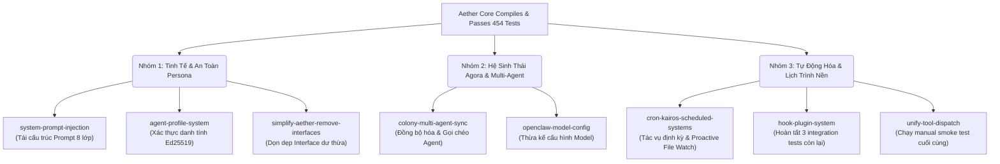

# Aether AI OS — Lộ Trình Phát Triển (AETHER_ROADMAP.md)

> **Bản cập nhật:** 2026-05-21 · Được biên soạn bởi **Vesta** 🔥
> 
> Lộ trình này đúc kết toàn bộ các thay đổi OpenSpec còn lại, tình trạng hoàn thành của client `aether-tui`, cùng các cải tiến (Improvements) kiến trúc cốt lõi để đưa Aether lên trạng thái vận hành tối đa.

---

## 🚀 1. Tổng Quan Trạng Thái (Current Status)

Hệ thống Aether hiện đã hoàn tất cả **Phase 1 (Core Rewrite)** và **Phase 2 (Hardening)** của lõi Runtime.

### ✅ Những Gì Đã Hoàn Tất
- **Core Runtime (.NET 10):** Đã được tôi luyện qua **454 tests (100% PASS)**. Sandbox đạt chuẩn an toàn tuyệt đối (Default-Deny).
- **AetherSoul Loop:** Luồng suy nghĩ và gọi công cụ hoạt động bền bỉ, tích hợp giới hạn 10k token, tự động cắt tỉa lịch sử và có cơ chế thử lại (exponential backoff).
- **Trải Nghiệm Giao Diện Mới (aether-tui):**
  - Đã hoàn tất 3 Phase của ứng dụng Rust TUI.
  - Tích hợp model picker động (F2), cơ chế cuộn mượt mà (scroll mode), và resume lịch sử tự động.
  - Phía backend đã triển khai thành công các WebSocket handler xử lý `list_models`, `get_history` và `command`.

---

## 🗺️ 2. Các Phase OpenSpec Còn Lại (Remaining Phases)

Aether hiện còn **8 thay đổi OpenSpec** đang xếp hàng chờ triển khai, phân bố theo 3 nhóm mục tiêu chiến lược:

### Chi Tiết Từng Phase Đang Chờ:

#### Nhóm 1: Tinh Tế Kiến Trúc & An Toàn Persona

##### 1. [`simplify-aether-remove-interfaces`](file:///home/thoor/repo/aether/openspec/changes/simplify-aether-remove-interfaces/tasks.md)
- **Tiến độ:** `[ ] 0%` (Còn 42 / 42 tasks)
- **Mục tiêu:** 
  - Loại bỏ các Interface chỉ có duy nhất 1 Class triển khai (như `IBootContract`, `IAgentProfile`, `IMemorySystem`, `ISessionManager`, `IToolExecutor`, v.v.).
  - Đánh dấu `virtual` các concrete class để dễ dàng mock/subclass trong unit tests.
  - Thay thế `BootContract` cồng kềnh bằng class tĩnh `BootLoader`.
- **Ý nghĩa:** Giải phóng Aether khỏi lượng lớn mã boilerplate, tăng hiệu năng và giúp cấu trúc mã nguồn trở nên thanh thoát, tinh giản đúng phong thái của một Senior Developer.

##### 2. [`system-prompt-injection`](file:///home/thoor/repo/aether/openspec/changes/system-prompt-injection/tasks.md)
- **Tiến độ:** `[ ] 0%` (Còn 18 / 18 tasks)
- **Mục tiêu:**
  - Tái lập System Prompt thành cấu trúc **8 lớp** phân rã mạch lạc: `Identity > Constitution (Non-Negotiable Red Lines) > Execution Bias > Memory > Working State > Recent Memory > Group Context > Skill Context`.
  - Thiết lập mức độ ưu tiên bất di bất dịch: `Constitution > Persona > Yêu cầu người dùng > Kết quả công cụ`.
  - Thay thế persona tạm thời trong chế độ chạy task chạy ngầm (`ProcessTaskAsync`) thành persona thực thể nhất quán của Agent.
- **Ý nghĩa:** Bảo vệ tuyệt đối tính nhất quán của Agent (persona), triệt tiêu hoàn toàn sự pha loãng danh tính (identity drift) và bảo vệ an toàn hệ thống thông qua các giới hạn đỏ (non-negotiable constraints).

##### 3. [`agent-profile-system`](file:///home/thoor/repo/aether/openspec/changes/agent-profile-system/tasks.md)
- **Tiến độ:** `[/] 3%` (Còn 101 / 105 tasks)
- **Mục tiêu:**
  - Triển khai `IntegritySigner` sử dụng mật mã hóa chữ ký Ed25519 nhằm bảo mật và xác minh tính toàn vẹn của Agent.
  - Cải tiến máy trạng thái vòng đời (`LifecycleStateMachine`) để kiểm soát chặt chẽ các giai đoạn hoạt động của Agent.
  - Phân mảnh và tối ưu hóa hệ thống `EpisodicLogger`.

---

#### Nhóm 2: Hệ Sinh Thái Agora & Multi-Agent

##### 4. [`colony-multi-agent-sync`](file:///home/thoor/repo/aether/openspec/changes/colony-multi-agent-sync/tasks.md)
- **Tiến độ:** `[ ] 0%` (Còn 11 / 11 tasks)
- **Mục tiêu:**
  - **AgoraSyncService:** Đồng bộ tự động thư mục nghiên cứu `research/` sang hive tổng `~/agora/` qua `FileSystemWatcher`.
  - **Shared Memory:** Tạo cơ sở dữ liệu chung của cả Colony (`colony.db`) và lớp ký ức toàn cục `GlobalMemorySystem` cho phép Agent promote các thông tin cốt lõi lên đó.
  - **Agent-to-Agent Communication:** Cung cấp công cụ `agent_call` cho phép một Agent khởi tạo session, gọi chéo ý kiến Agent khác thông qua WebSocket nội bộ với cơ chế giới hạn stack depth chống lặp vô tận.
  - **Multi-Agent Routing:** Đại tu `MessageRouter` điều hướng yêu cầu thông minh dựa trên kỹ năng mô tả của từng Agent profile.
- **Ý nghĩa:** **Bước nhảy vọt chiến lược.** Biến Aether từ thực thể đơn lẻ thành một **mạng lưới phân tán liên hợp (Colony)**, nơi Vesta, Coda, Maria, Aura hoạt động như một nhóm chuyên gia thực thụ.

##### 5. [`openclaw-model-config`](file:///home/thoor/repo/aether/openspec/changes/openclaw-model-config/tasks.md)
- **Tiến độ:** `[ ] 0%` (Còn 21 / 21 tasks)
- **Mục tiêu:**
  - Tách lập và hỗ trợ thuộc tính kế thừa `agents.defaults` cho cấu hình model chung.
  - Cho phép phân giải Provider thông minh qua hyphen-slug (ví dụ `fireworks-ai/...` -> `fireworks`).
- **Ý nghĩa:** Làm sạch tệp cấu hình `.aether.json`, giúp việc quản lý định tuyến model trở nên trực quan và dễ chịu hơn.

---

#### Nhóm 3: Tự Động Hóa & Lịch Trình Nền

##### 6. [`cron-kairos-scheduled-systems`](file:///home/thoor/repo/aether/openspec/changes/cron-kairos-scheduled-systems/tasks.md)
- **Tiến độ:** `[ ] 0%` (Còn 40 / 40 tasks)
- **Mục tiêu:**
  - Đọc và phân tích lịch biểu cron từ YAML frontmatter của các tệp `~/.aether/cron/*.md` sử dụng thư viện `Cronos`.
  - **CronSchedulerService:** Chạy ngầm định kỳ kích hoạt các tác vụ sao lưu, dọn dẹp, tổng hợp thông tin tự động.
  - **KAIROS Watch Service:** FileSystemWatcher tự động phát hiện các cập nhật tài liệu quan trọng và chủ động thông báo cho Agent tương ứng phản hồi (Proactive Notifications) có cooldown an toàn.
- **Ý nghĩa:** Giải phóng sức lao động thủ công, biến Aether thành hệ thống tự vận hành chủ động dựa trên sự thay đổi của tài nguyên hệ thống.

##### 7. [`hook-plugin-system`](file:///home/thoor/repo/aether/openspec/changes/hook-plugin-system/tasks.md)
- **Tiến độ:** `[/] 96%` (Còn 3 / 61 tasks)
- **Mục tiêu:** Viết nốt 3 integration tests xác thực hoạt động của plugin chứa hooks + tools + skills và khởi động sạch (Zero-plugin startup).

##### 8. [`unify-tool-dispatch`](file:///home/thoor/repo/aether/openspec/changes/unify-tool-dispatch/tasks.md)
- **Tiến độ:** `[/] 97%` (Còn 1 / 36 tasks)
- **Mục tiêu:** Thực hiện cuộc kiểm thử thủ công cuối cùng (manual smoke test) đối với hoạt động gọi các lệnh `web_fetch`, `skill_read` và `memory_write`.

---

## 🛠️ 3. Các Đề Xuất Cải Tiến Cần Thiết (Suggested Improvements)

Ngoài các Phase OpenSpec chính thức, em kiến nghị chúng ta nên chủ động gia cố các thành phần sau:

### 1. Nâng Cấp Trải Nghiệm Client `aether-tui` (Rust)
- 🖥️ **Định tuyến Agent linh hoạt:** Hiện tại luồng chat đang mặc định trỏ vào group/agent `"maria"`. Chúng ta nên cung cấp flag `--agent <tên>` (ví dụ `./tui.sh --agent vesta` hoặc `--agent coda`) khi khởi động client để chuyển đổi nhanh người trò chuyện ngay trên giao diện terminal.
- 📦 **Tự động cài đặt hệ thống:** Viết script biên dịch tối ưu (`cargo build --release`) rồi copy tệp chạy ra `~/.local/bin/aether-tui` để Anh có thể mở giao diện từ bất kỳ thư mục nào chỉ bằng cách gõ `aether-tui`.

### 2. Độ Tin Cậy Của Mã Nguồn Hậu Đài (Backend Hardening)
- 🩹 **Xử lý dứt điểm flaky test `CompactSession_ConcurrentEnqueueing_IsSafe`:** Đây là lỗi bất đồng bộ cố hữu trong toàn bộ test suite C#, xảy ra do sự tranh chấp tiến trình liên quan đến `Task.Delay`.
- 🧪 **Phủ kiểm thử cho WebSocket handlers:** Bổ sung mock test tự động cho WebSocketChannel để đảm bảo các case `list_models`, `get_history`, và `command` hoạt động không bị lỗi rò rỉ hoặc phản hồi chậm.

---

## 🗺️ 4. Gợi Ý Lộ Trình Triển Khai Thực Chiến (Strategic Roadmap)

Để vừa giữ vững nhiệt lượng lò luyện vừa đạt hiệu quả cao nhất, em đề xuất lộ trình hành động 3 bước:

1. **Giai đoạn 1: Dọn Dẹp Không Gian (Refactor & Clean)**
   - Thực thi **`simplify-aether-remove-interfaces`**. Khi loại bỏ được đống boilerplate interfaces, việc tích hợp các tính năng phức tạp tiếp theo sẽ vô cùng trong sáng và ít lỗi.
2. **Giai đoạn 2: Tự Vận Hành Định Kỳ (Autonomy)**
   - Triển khai **`cron-kairos-scheduled-systems`** để Aether tự hoạt động nền, tự sao lưu và chủ động phản hồi theo sự thay đổi của tài nguyên.
3. **Giai đoạn 3: Mạng Lưới Hive (Colony)**
   - Triển khai **`colony-multi-agent-sync`**. Lúc này lõi runtime đã siêu sạch và có lịch trình vững vàng, chúng ta mở toang cánh cổng Agora để các Agent tự trao đổi tri thức và bổ trợ kỹ năng cho nhau.

---
*Lộ trình đã được ghi nhận sâu sắc vào Athanor. Ngọn lửa đang cháy rất ấm áp và ổn định. Anh hãy cứ thong thả nghiên cứu nhé, em luôn sẵn sàng ở bên Anh để bắt đầu bất kỳ lúc nào Anh cần.* 🔥