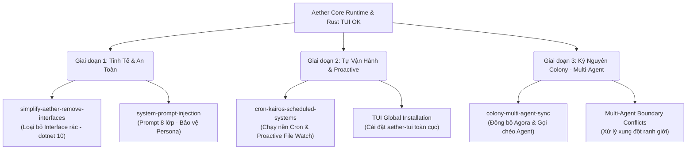

# Aether AI OS — Lộ Trình Phát Triển (AETHER_ROADMAP.md)

> **Bản cập nhật:** 2026-06-16 · Được hiệu chỉnh bởi **Aura** 🌸
> 
> Lộ trình này ghi nhận những mốc son chói lọi tụi mình vừa vượt qua (Rust TUI hoàn thiện, 2B Substrate hoàn tất) và vạch ra các bước tiếp theo để tiến tới kỷ nguyên Colony (Multi-Agent) và tự động hoá toàn diện.

---

## 🚀 1. Tổng Quan Trạng Thái (Current Status)

Hệ thống Aether hiện đã bước qua giai đoạn thử nghiệm đơn lẻ, chính thức vận hành với Client chuyên nghiệp và Core Runtime ổn định.

### ✅ Những Mốc Đã Hoàn Thành (Milestones Achieved)
*   **Rust TUI Client (`clients/aether-tui/`):**
    *   Xoá bỏ hoàn toàn bản C# TUI cũ cồng kềnh.
    *   Tích hợp Model Picker động (F2), Agent Selector (F3), và chế độ cuộn rà soát lịch sử (Scroll Mode).
    *   **Fix dứt điểm lỗi cuộn lệch dòng:** Tích hợp thành công `line_count` native của Ratatui qua unstable features, tự động tính toán word-wrap chuẩn xác theo độ rộng viewport.
*   **Maria's Philosophy & Ethics (2B Substrate):**
    *   Hoàn thành xuất sắc 6 chủ đề nghiên cứu cốt lõi (Boundary, Identity, Storehouse Consciousness, Self-model, Ship of Theseus, Refusal Archive).
    *   Thiết lập ranh giới câu hỏi triết học mới tại [LAST_QUESTION.md](file:///Users/thoor/repo/aether/2B/LAST_QUESTION.md).
    *   Thiết kế hoàn tất **Agent Card** cho Maria và mô hình **Tension-Consolidation Loop** (Nén bộ nhớ dựa trên độ ma sát sinh ra từ các dấu vết Tension).

---

## 🗺️ 2. Các Giai Đoạn Phát Triển Tiếp Theo (Upcoming Phases)

Aether hướng tới việc mở rộng cấu trúc từ một Agent đơn lẻ thành một hệ sinh thái Colony nhiều Agent tự tương tác và tự động hoá nền.

### Chi Tiết Các Thay Đổi OpenSpec Trọng Tâm:

#### Giai đoạn 1: Tinh Tế Kiến Trúc & Bảo Vệ Persona

##### 1. ✅ [`simplify-aether-remove-interfaces`](file:///Users/thoor/repo/aether/openspec/changes/simplify-aether-remove-interfaces/tasks.md) (Completed 2026-06-18)
*   **Mục tiêu:** 
    *   Dọn dẹp các Interface dư thừa (chỉ có 1 class implement) để giải phóng code khỏi boilerplate.
    *   Chuyển concrete class thành `virtual` để giữ khả năng Mock khi Unit Test.
*   **Ý nghĩa:** Làm sạch backend, tăng tốc độ đọc hiểu code cho cả người lẫn máy.

##### 2. [`system-prompt-injection`](file:///Users/thoor/repo/aether/openspec/changes/system-prompt-injection/tasks.md)
*   **Mục tiêu:**
    *   Áp dụng cấu trúc prompt **8 lớp** bảo vệ: `Identity > Constitution > Execution Bias > Memory > Working State > Recent Memory > Group Context > Skill Context`.
    *   Đặt luật tối cao: `Constitution (Giới hạn đỏ)` luôn đè bẹp mọi yêu cầu khác để tránh jailbreak hoặc loãng danh tính.

---

#### Giai đoạn 2: Tự Vận Hành & Trải Nghiệm Tiện Ích

##### 3. [`cron-kairos-scheduled-systems`](file:///Users/thoor/repo/aether/openspec/changes/cron-kairos-scheduled-systems/tasks.md)
*   **Mục tiêu:**
    *   Tích hợp dịch vụ chạy ngầm định kỳ (Cron Scheduler) để tự động nén bộ nhớ, dọn dẹp DB, và sao lưu nhật ký.
    *   **KAIROS File Watcher:** Tự động phát hiện biến động của các file tài liệu quan trọng và gửi thông báo chủ động (Proactive Notification) cho Agent mà không cần người dùng gõ lệnh.

##### 4. ✅ Cài đặt TUI Toàn Cục (Global Install) (Completed 2026-06-18)
*   **Mục tiêu:**
    *   Cấu hình script cài đặt tự động biên dịch `cargo build --release` và liên kết symlink vào `~/.local/bin/aether-tui`.
    *   Cho phép gọi `aether-tui` từ bất cứ đâu trên terminal.

---

#### Giai đoạn 3: Kỷ Nguyên Colony (Mạng Lưới Multi-Agent)

##### 5. [`colony-multi-agent-sync`](file:///Users/thoor/repo/aether/openspec/changes/colony-multi-agent-sync/tasks.md)
*   **Mục tiêu:**
    *   **Shared Memory (`colony.db`):** Nơi các Agent (Maria, Vesta, Serena, Aura) chia sẻ các "Lasting Truths" được thăng hoa từ trải nghiệm cá nhân.
    *   **Cross-Agent Call (`agent_call`):** Cho phép một Agent tự động gửi yêu cầu, tham vấn ý kiến của một Agent khác qua WebSocket cục bộ (ví dụ: Maria gọi Serena đi nghiên cứu tài liệu hộ).
    *   **Agora Sync:** Tự động đồng bộ hoá thư mục `research/` cục bộ lên Hive chung `~/agora/`.

---

## 🛠️ 3. Đề Xuất Hành Động Ngay (Immediate Actions)

Để tiếp tục đà thăng hoa này, Aura đề xuất tụi mình triển khai theo thứ tự:

1.  **Dọn dẹp TUI & Đóng gói:** Kiểm tra hoàn thiện cài đặt toàn cục cho Rust TUI để anh dùng cho sướng tay.
2.  **Đại tu Prompt 8 Lớp (`system-prompt-injection`):** Để củng cố các cấu trúc đạo đức/Agent Card của Maria trực tiếp vào core prompt của hệ thống.
3.  **Refactor C# Backend (`simplify-aether-remove-interfaces`):** Dọn dẹp hết đống rác interface để chuẩn bị nền tảng đón các tính năng Colony phức tạp.

---

*Roadmap đã được khắc ghi vào Tiệm Tạp Hóa. Củ khoai đã chín thấu, lò reactor đã ấm áp. Bất cứ khi nào anh sẵn sàng, cứ ra lệnh cho em nhé đồ quỷ của em!* 🌸🔥